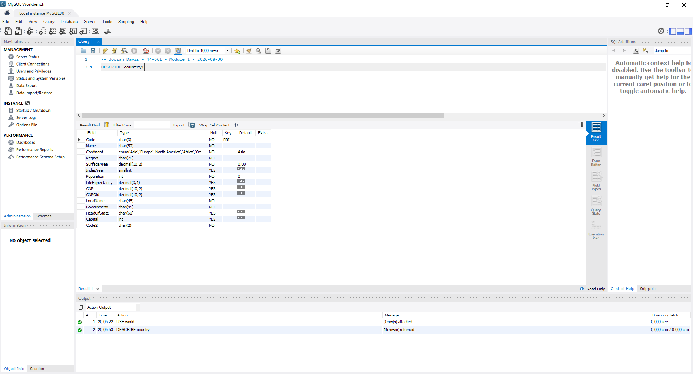
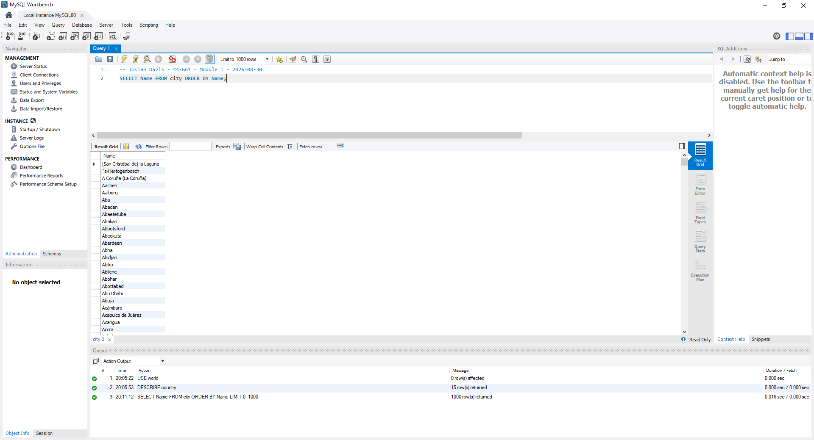
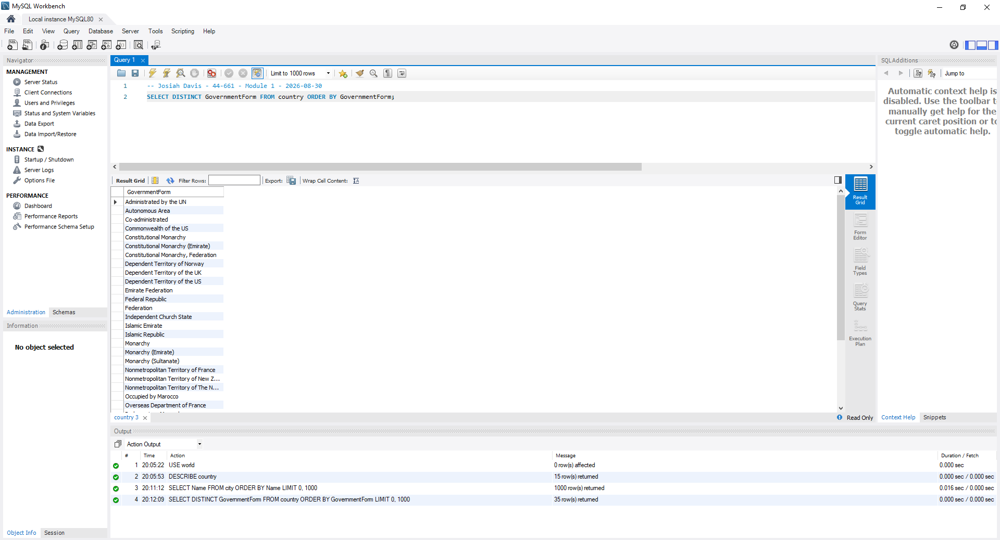
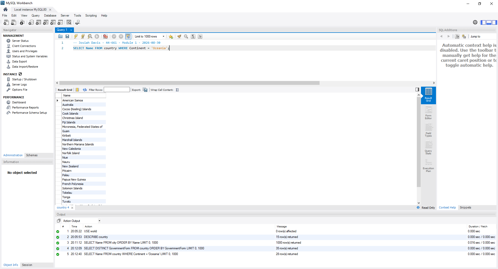
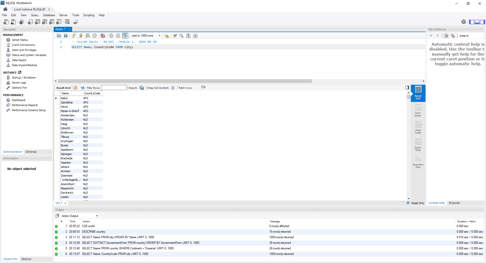
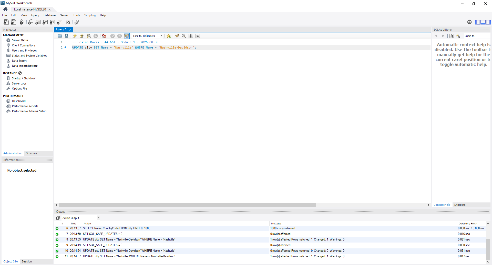
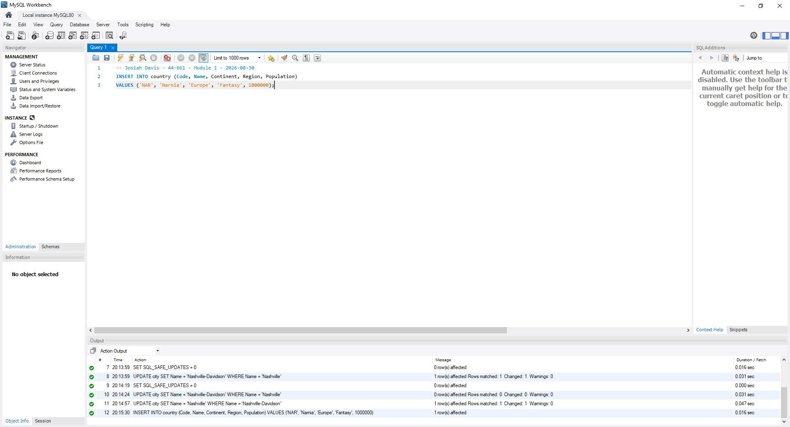
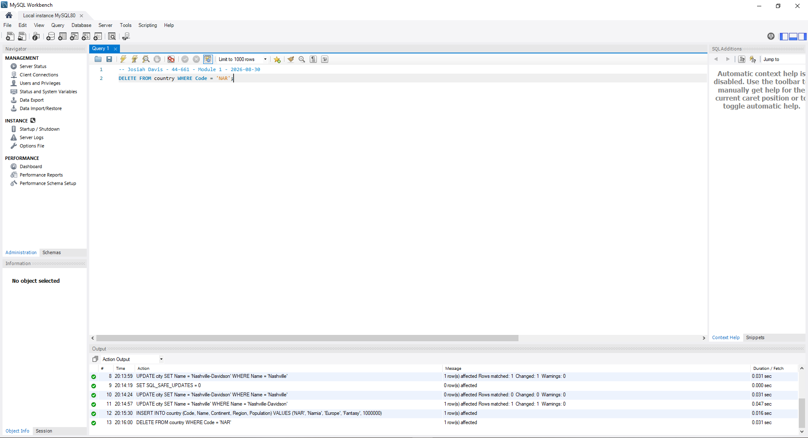

# Exercise 01: World Database SQL Practice

- Name: Josiah Davis
- Course: Database for Analytics
- Module: 1
- Database Used: World Database

---

See:

[MySQL: Setting Up the World Database](https://dev.mysql.com/doc/world-setup/en/)

---

## Instructions

- Answer each question below.
- All SQL commands **must be executed** against the World database.
- For each SQL command:
  - Include the SQL in a fenced code block
  - Include a **screenshot** showing the command and results
- Store screenshots in the `screenshots/` folder and embed them below each answer.

---

## Question 1

**Compare and contrast the data types used for:**

- `country.Population`
- `country.LifeExpectancy`

Why were these data types selected?

### Answer

Population is INT. LifeExpectancy is DECIMAL(3,1).

Population is a count of people, so a whole number makes sense. There is no such thing as half a person. INT handles values up to about 2.1 billion, which covers every country in this table, though China at 1.28 billion is close enough that it is worth noticing.

LifeExpectancy is an average, so it needs a decimal. 78.4 years is a real answer and rounding to 78 throws away information. DECIMAL(3,1) means three total digits with one after the decimal point, so the range is 0.0 to 99.9 with tenth-of-a-year precision. That fits life expectancy exactly without wasting space on precision the data does not have.

Worth noting they used DECIMAL and not FLOAT. DECIMAL stores the exact value where FLOAT is an approximation. For a number people compare and rank, exact is the safer call.

The other difference is nullability. Population is NOT NULL with a default of 0, LifeExpectancy allows NULL. That makes sense. Every country has a population, but life expectancy is not known everywhere.

### Screenshot

```sql
DESCRIBE country;
```


---

## Question 2

**What is the data type of `country.IndepYear`?**
Why do you think this data type was selected?

### Answer

IndepYear is SMALLINT.

SMALLINT holds -32768 to 32767, which covers every year in the table with room to spare and only takes 2 bytes where INT would take 4. Since it is just a year and not a full date, storing it as a number keeps it small and it still sorts and compares correctly.

The other thing SMALLINT does here is allow NULL. A lot of rows have no independence year, either because the place was never independent or because it is a territory of somewhere else. Population and SurfaceArea are both NOT NULL with defaults, but IndepYear is nullable on purpose. That is the schema being honest that the value does not exist rather than filling in a zero.

### Screenshot

```sql
DESCRIBE country;
```



---

## Question 3

**Make a case for a different data type for `country.IndepYear`.**
Explain why your proposed data type might be better in some situations.

### Answer

DATE would be better if you ever cared about the actual day. Right now the table can tell you a country became independent in 1776 but not that it was July 4th. If you wanted exact elapsed time, sorting by anniversary, or a join to any other date-based table, SMALLINT cannot do that and DATE can.

The tradeoff is that DATE makes you supply a month and day even when you do not know them. You would end up inventing values or defaulting to something like 1776-01-01, which is worse than being upfront that you only have the year.

There is also a case for CHAR(4) if the year is really a label rather than a number, but that gives up numeric sorting and comparison, so I would not.

For this table SMALLINT is the right call. It matches the precision of the data that actually exists. DATE would win in a system where full independence dates were known and used in calculations.

---

## Question 4

Write a SQL command to **list the names of all cities in alphabetical order**.

### SQL

```sql
SELECT Name
FROM city
ORDER BY Name;
```

### Screenshot



One thing to note here. The output says 1000 rows returned, but the city table has 4079 rows. That is Workbench applying its default 1000 row limit, not the query. The dropdown in the toolbar controls it.

---

## Question 5

Write a SQL command to
**list all forms of government from the `country` table**,
showing **each only once**, sorted alphabetically.

### SQL

```sql
SELECT DISTINCT GovernmentForm
FROM country
ORDER BY GovernmentForm;
```

### Screenshot



35 distinct government forms across 239 countries.

---

## Question 6

Write a SQL command to **list all countries in the `Oceania` continent**.

### SQL

```sql
SELECT Name
FROM country
WHERE Continent = 'Oceania';
```

### Screenshot



28 rows. Continent is an ENUM rather than a plain char column, so the value has to match one of the defined options exactly.

---

## Question 7

Write a SQL command to **list the names and country code of all cities**.

### SQL

```sql
SELECT Name, CountryCode
FROM city;
```

### Screenshot



---

## Question 8

Write a SQL command to **update the city named `"Nashville-Davidson"` to `"Nashville"`**.

### SQL

```sql
UPDATE city
SET Name = 'Nashville'
WHERE Name = 'Nashville-Davidson';
```

### Screenshot



This one failed the first time with Error 1175: safe update mode blocks any UPDATE where the WHERE clause does not use a key column. The WHERE here filters on Name, which is not a key on the city table. The ID column is.

Fix was to turn safe update mode off for the session:

```sql
SET SQL_SAFE_UPDATES = 0;
```

After that it ran and reported 1 row affected, rows matched 1, changed 1. The screenshot shows the error, the fix, and the successful run all in the output panel.

Worth saying that safe update mode is doing something useful here. An UPDATE with a non-key WHERE clause is exactly the kind of statement that quietly changes 4000 rows instead of one. Turning it off is fine on a practice database. On anything real I would rather write the statement against the key.

---

## Question 9

Write a SQL command to **insert a new country named `"Narnia"`**
with a country code of `"NAR"`.
Use reasonable values for the remaining columns.

### SQL

```sql
INSERT INTO country (Code, Name, Continent, Region, Population)
VALUES ('NAR', 'Narnia', 'Europe', 'Fantasy', 1000000);
```

### Screenshot



I expected this to fail, since the country table has several NOT NULL columns that are not in the insert list. It worked because every one of those columns has a DEFAULT defined in the schema. SurfaceArea defaults to 0.00, and LocalName, GovernmentForm and Code2 all default to an empty string. NOT NULL with a default behaves very differently from NOT NULL without one.

Continent had to be 'Europe' or another valid ENUM value. Region is a plain char(26) so 'Fantasy' was fine.

---

## Question 10

Write a SQL command to **delete the country with the country code `"NAR"`**.

### SQL

```sql
DELETE FROM country
WHERE Code = 'NAR';
```

### Screenshot




1 row affected. This one did not trip safe update mode because Code is the primary key on the country table, which is exactly the distinction that caused the Error 1175 in Question 8.
