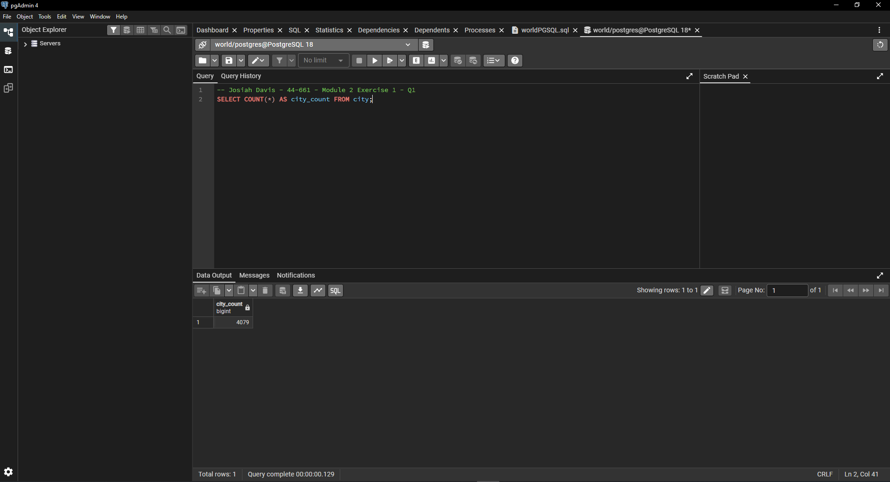
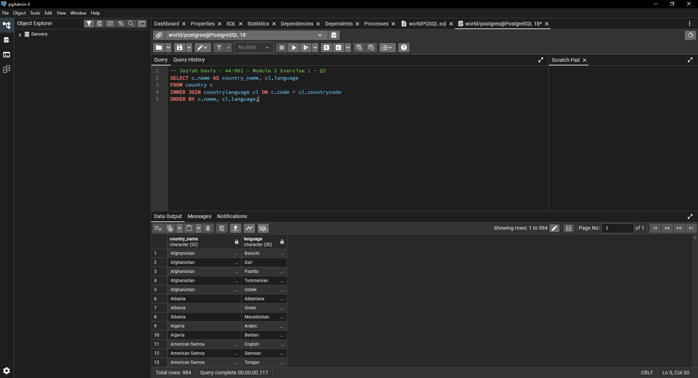
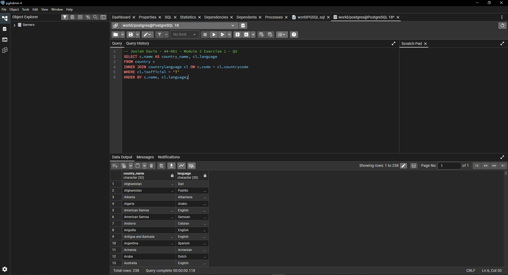
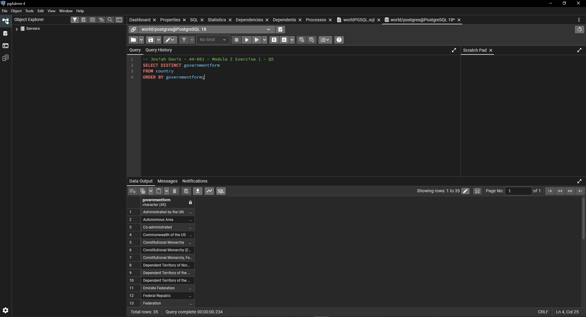
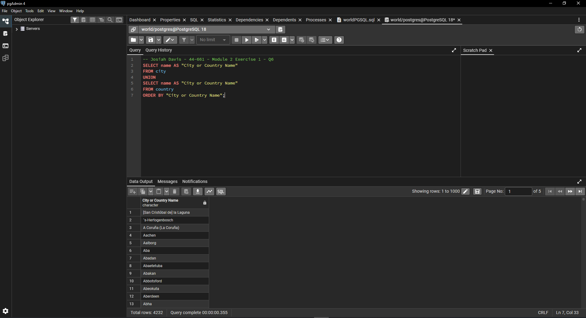
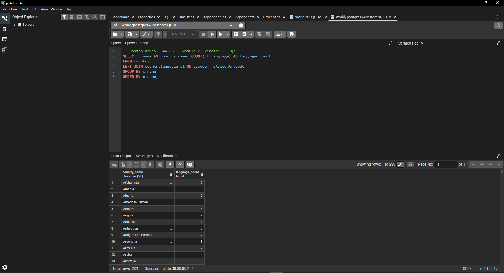
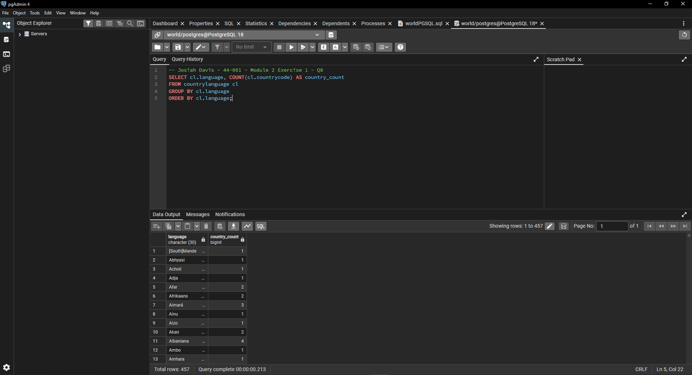
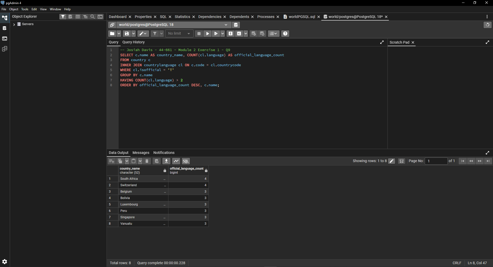
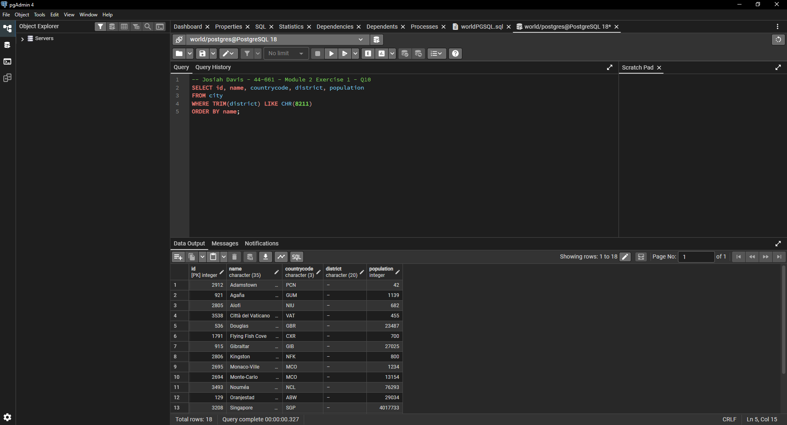
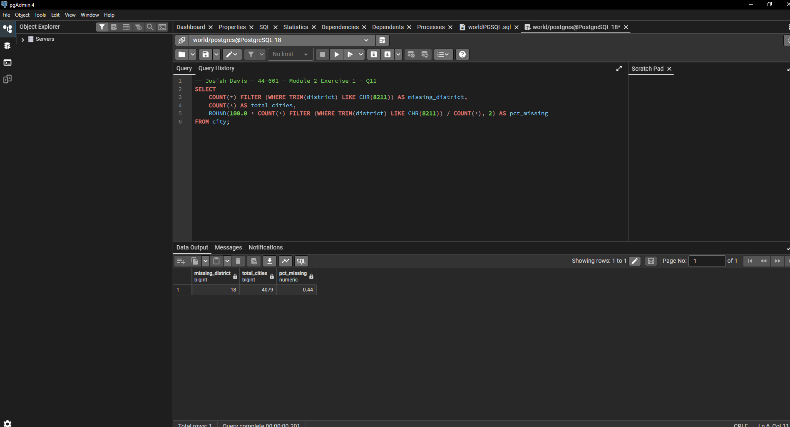

# Exercise 02: World Database – Joins, Grouping, and Data Quality

- Name: Josiah Davis
- Course: Database for Analytics
- Module: 2
- Database Used: World Database (PostgreSQL)

---

## Instructions

- Answer each question below using SQL executed against the **World database**.
- All SQL commands **must be run by you**.
- For each SQL-based question:
  - Include the SQL command in a fenced code block
  - Include a **screenshot** showing the command and its results
- Store screenshots in the `screenshots/` folder and embed them below each answer.

---

## Question 1

When importing records from `worldPGSQL.sql`, **how many cities were imported**?

### Answer

4,079 cities.

### Screenshot

```sql
SELECT COUNT(*) AS city_count FROM city;
```



---

## Question 2

Using the World database, write the SQL command to
**display each country name**
along with the **name of each language spoken in that country**.

### SQL

```sql
SELECT c.name AS country_name, cl.language
FROM country c
INNER JOIN countrylanguage cl ON c.code = cl.countrycode
ORDER BY c.name, cl.language;
```

984 rows, which is every row in countrylanguage.

### Screenshot



---

## Question 3

Using the World database, write the SQL command
to **display each country name** along with the name
of each **official language spoken in that country**.

### SQL

```sql
SELECT c.name AS country_name, cl.language
FROM country c
INNER JOIN countrylanguage cl ON c.code = cl.countrycode
WHERE cl.isofficial = 'T'
ORDER BY c.name, cl.language;
```

238 rows. I checked the column first with SELECT DISTINCT isofficial and it stores 'T' and 'F' as character(2), not a boolean, so the filter is = 'T' and not = TRUE.

### Screenshot



---

## Question 4

Consider the following two SQL statements:

```sql
SELECT *
FROM country, countrylanguage
WHERE country.code = countrylanguage.countrycode;
```

```sql
SELECT *
FROM country
LEFT OUTER JOIN countrylanguage
ON country.code = countrylanguage.countrycode;
```

**In your own words**, describe what data the
**second query returns that the first query does not**.

### Answer

The first one is an inner join written the old way, with the join condition sitting in the WHERE clause. It only gives you countries that have at least one language row. The second gives you every country either way and fills the countrylanguage columns with NULL when there is no match.

The first returns 984 rows and the second returns 990. Those 6 extra rows are countries with nothing in countrylanguage at all: Antarctica, Bouvet Island, British Indian Ocean Territory, French Southern territories, Heard Island and McDonald Islands, and South Georgia and the South Sandwich Islands. All six are uninhabited, so there is nobody there to record a language for.

That is the part that matters. If you counted countries off the first query you would get 233 instead of 239, and nothing in the output would tell you six went missing.

---

## Question 5

Using the World database, write the SQL command
to **list all different forms of government** found in the data.
Do **not** repeat any form of government more than once.

### SQL

```sql
SELECT DISTINCT governmentform
FROM country
ORDER BY governmentform;
```

35 distinct forms of government.

### Screenshot



---

## Question 6

Using the World database, write the SQL command
to **list all names of cities and countries in one column**.
Label the column **"City or Country Name"**.

### SQL

```sql
SELECT name AS "City or Country Name"
FROM city
UNION
SELECT name AS "City or Country Name"
FROM country
ORDER BY "City or Country Name";
```

4,232 rows. There are 4,079 cities and 239 countries, so that should add up to 4,318. UNION dropped 86 duplicates where the same name is both a city and a country, like Singapore and Monaco. UNION ALL would have kept all 4,318.

The alias needs double quotes in Postgres to keep the spaces and capital letters. Single quotes would make it a string instead of a column name.

### Screenshot



---

## Question 7

Using the World database, write the SQL command
to **list all countries by name**,
along with the **number of languages spoken in each country**.
Be sure to **sort by country name**.

### SQL

```sql
SELECT c.name AS country_name, COUNT(cl.language) AS language_count
FROM country c
LEFT JOIN countrylanguage cl ON c.code = cl.countrycode
GROUP BY c.name
ORDER BY c.name;
```

239 rows. I used a LEFT JOIN because the question says all countries. The same six uninhabited territories from Question 4 come back with a count of 0. An INNER JOIN would have returned 233 and dropped them without saying anything.

### Screenshot



---

## Question 8

Using the World database, write the SQL command
to **list all languages**, along with the
**number of countries where each language is spoken**.
Be sure to **sort by language name**.

### SQL

```sql
SELECT cl.language, COUNT(cl.countrycode) AS country_count
FROM countrylanguage cl
GROUP BY cl.language
ORDER BY cl.language;
```

457 languages. No join needed on this one since both columns live in countrylanguage.

### Screenshot



---

## Question 9

Using the World database, write the SQL command
to **list countries that have more than two official languages**,
along with the **number of official languages spoken**.

_Hint: There are 8 such countries in this dataset._

### SQL

```sql
SELECT c.name AS country_name, COUNT(cl.language) AS official_language_count
FROM country c
INNER JOIN countrylanguage cl ON c.code = cl.countrycode
WHERE cl.isofficial = 'T'
GROUP BY c.name
HAVING COUNT(cl.language) > 2
ORDER BY official_language_count DESC, c.name;
```

8 countries. South Africa and Switzerland have 4, and Belgium, Bolivia, Luxembourg, Peru, Singapore, and Vanuatu have 3.

The official language filter goes in WHERE because it filters rows, and the count filter goes in HAVING because it filters groups after the GROUP BY runs. You cannot put a COUNT in a WHERE clause.

### Screenshot



---

## Question 10

Using the World database, write the SQL command to
**find cities where the district value is missing**.

Hint: Use `LIKE` and the dash (`-`)
since some rows use that instead of actual data.

### SQL

```sql
SELECT id, name, countrycode, district, population
FROM city
WHERE TRIM(district) LIKE CHR(8211)
ORDER BY name;
```

18 rows.

This one took a few tries. Comparing against a regular hyphen gave me nothing back. I ran SELECT DISTINCT ASCII(TRIM(district)) FROM city WHERE LENGTH(TRIM(district)) = 1 and the character came back as 8211, which is an en dash, not a hyphen. They look identical on screen.

The TRIM matters too. District is character(20), so the stored value is the en dash plus 19 spaces, and a LIKE against the raw column will not match a single character.

There are also 4 rows where district is blank instead of an en dash, so 22 rows total are missing something. The 18 en dash rows are what the question is pointing at.

All 18 are small territories or city-states where a district does not really apply: Adamstown, Vatican City, Gibraltar, Monaco-Ville, Singapore, and the like.

### Screenshot



---

## Question 11

Using the World database, write the SQL command to
**calculate the percentage of cities with missing district values**.

_Hint: The result should be approximately 0.4%._

### SQL

```sql
SELECT
    COUNT(*) FILTER (WHERE TRIM(district) LIKE CHR(8211)) AS missing_district,
    COUNT(*) AS total_cities,
    ROUND(100.0 * COUNT(*) FILTER (WHERE TRIM(district) LIKE CHR(8211)) / COUNT(*), 2) AS pct_missing
FROM city;
```

18 out of 4,079, or 0.44%.

The 100.0 has to have the decimal on it. With a plain 100 Postgres does integer division and returns 0.

### Screenshot


