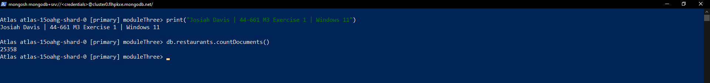
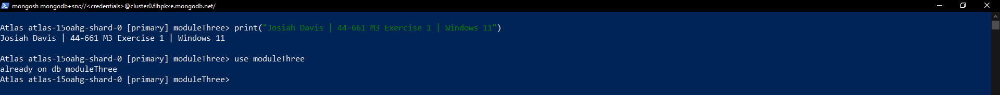
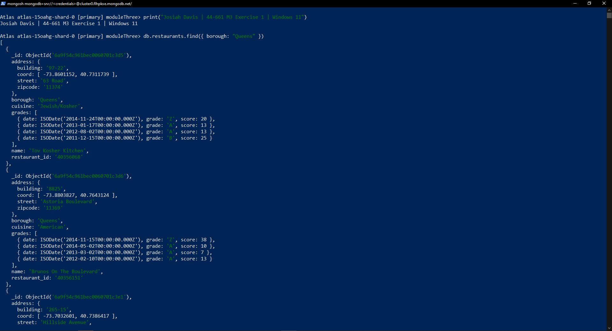
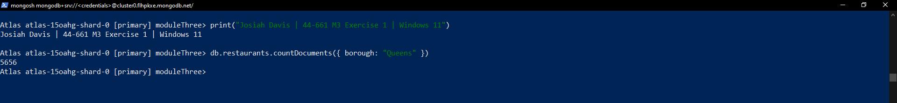
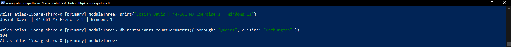
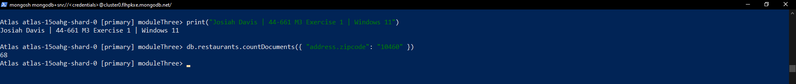
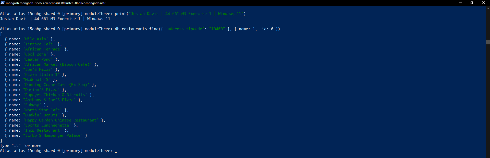
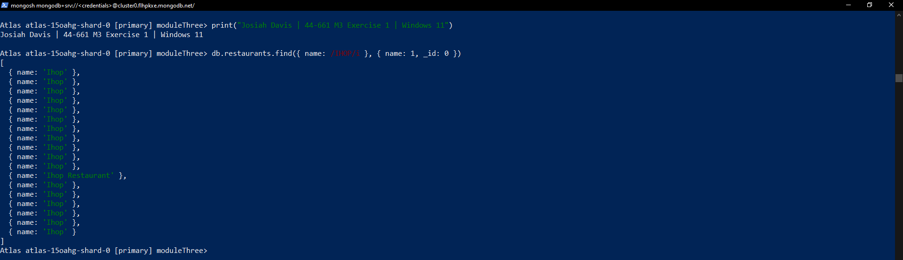

# Exercise 03: MongoDB – Document Queries and Analysis

- Name: Josiah Davis
- Course: Database for Analytics
- Module: 3
- Database Used: MongoDB (Atlas, free M0 cluster)
- Dataset: `restaurants-json.json`

---

## Note on Naming

My database is named `moduleThree` and my collection is named `restaurants`,
rather than `44661`. The queries below use my actual names.

MongoDB won't let you reference a collection with dot notation when the name
starts with a digit, so `db.44661.find()` fails as a syntax error. A descriptive
name is also easier to read six months from now.

I'm running against a MongoDB Atlas cluster rather than a local install. The
local Community Edition install failed on my machine with
`STATUS_ENTRYPOINT_NOT_FOUND` and wouldn't start as a service. Atlas runs the
same MongoDB 8.0 engine and the query syntax is identical.

- Database: `moduleThree`
- Collection: `restaurants`
- Shell: mongosh 2.10.0
- Server: MongoDB 8.0.32

---

## Instructions

- Import the provided `restaurants-json.json` file into MongoDB.
- All commands must be **executed by you** in the MongoDB shell or MongoDB Compass.
- For each query:
  - Include the MongoDB command in a fenced code block
  - Include a **screenshot** showing the command and its result
- Store screenshots in the `screenshots/` folder and embed them below each answer.

---

## Question 1

When importing the documents from `restaurants-json.json`,
**how many documents were imported into your collection**?

### Answer

**25,358 documents.**

I got this from `countDocuments()`, which returns how many documents are in the
collection. With no filter it counts everything. The number matched what Compass
reported after the import finished, so nothing got dropped on the way in.

```javascript
db.restaurants.countDocuments()
```

### Screenshot



---

## Question 2

Before writing queries on the data,
**what command** do you use to set the
**MongoDB shell to operate on the `44661` database**?

### MongoDB Command

```javascript
use moduleThree
```

`use` switches the active database so that `db` points at it. Every query after
that resolves `db.restaurants` against `moduleThree`. Skip it and the shell stays
on whatever it connected to, which is `test` by default, and your queries come
back empty because the collection isn't there.

`use` will also switch to a database that doesn't exist yet. MongoDB doesn't
create one until something gets written to it, so a successful `use` doesn't
prove your data is where you think it is. That's why I ran the count in
Question 1 first.

### Screenshot



---

## Question 3

Using your `restaurants` collection in the `44661` database,
write the MongoDB query needed to
**locate all documents in the `"Queens"` borough**.

### MongoDB Query

```javascript
db.restaurants.find({ borough: "Queens" })
```

`find()` takes a filter document. `{ borough: "Queens" }` matches every document
where `borough` equals that string exactly, case included. The shell returns the
first batch and prints `Type "it" for more`, since the result set is bigger than
one screen.

### Screenshot



---

## Question 4

Using your `restaurants` collection in the `44661` database,
write the MongoDB query needed to
**find the number of restaurants in the `"Queens"` borough**.

### MongoDB Query

```javascript
db.restaurants.countDocuments({ borough: "Queens" })
```

**Result: 5,656 restaurants.**

Same filter as Question 3, different method. `find()` hands back the documents,
`countDocuments()` hands back how many matched. Counting on the server side is a
lot cheaper than pulling 5,656 documents across the network just to count them
when they arrive.

### Screenshot



---

## Question 5

Using your `restaurants` collection in the `44661` database,
write the MongoDB query needed to
**find the number of restaurants** in the `"Queens"` borough
**whose cuisine is `"Hamburgers"`**.

### MongoDB Query

```javascript
db.restaurants.countDocuments({ borough: "Queens", cuisine: "Hamburgers" })
```

**Result: 104 restaurants.**

Two fields in the same filter document are an implicit AND, so a document has to
satisfy both to match. You don't need an `$and` operator for straight equality
checks on separate fields. It works out to the same thing as
`WHERE borough = 'Queens' AND cuisine = 'Hamburgers'` in SQL.

### Screenshot



---

## Question 6

Using your `restaurants` collection in the `44661` database,
write the MongoDB query needed to
**find the number of restaurants in Zipcode `10460`**.

_Hint: Look up how to query **embedded documents**._

### MongoDB Query

```javascript
db.restaurants.countDocuments({ "address.zipcode": "10460" })
```

**Result: 68 restaurants.**

`zipcode` isn't a top-level field. It lives inside the embedded `address`
document along with `building`, `coord`, and `street`. Dot notation reaches into
it, and the field path needs quotes around it because of the dot.

There are two easy ways to get zero results here. Querying `{ zipcode: "10460" }`
finds nothing, since no top-level field by that name exists. And the zipcode is
stored as a string, not a number, so `{ "address.zipcode": 10460 }` without the
quotes also returns zero. MongoDB doesn't coerce types when matching, so
`"10460"` and `10460` are different values.

### Screenshot



---

## Question 7

Using your `restaurants` collection in the `44661` database,
write the MongoDB query needed to
**display only the names of restaurants in Zipcode `10460`**.

_Hint: Look up how to **project fields** in MongoDB._

### MongoDB Query

```javascript
db.restaurants.find({ "address.zipcode": "10460" }, { name: 1, _id: 0 })
```

`find()` takes a second argument called the projection, which controls what comes
back. `name: 1` includes the name. `_id: 0` suppresses the id.

The `_id: 0` is the easy one to miss. MongoDB returns `_id` by default whether
you asked for it or not, so a projection of just `{ name: 1 }` still prints an id
next to every name. It's also the only field you can exclude in a projection that
otherwise only includes things.

Projection isn't only about clean output. Returning one field instead of the whole
document cuts down what crosses the network, same reason you don't write
`SELECT *` against a wide table.

### Screenshot



---

## Question 8

Using your `restaurants` collection in the `44661` database,
write the MongoDB query needed to
**display only the names of restaurants whose name contains `"IHOP"`**,
ignoring case.

Your results should include:

- `"Ihop"`
- `"Ihop Restaurant"`

### MongoDB Query

```javascript
db.restaurants.find({ name: /IHOP/i }, { name: 1, _id: 0 })
```

**Result: 18 matches. 17 named `Ihop` and one named `Ihop Restaurant`.**

`/IHOP/i` is a regular expression literal. What sits between the slashes is the
pattern, and the `i` after the closing slash makes it case insensitive. Drop the
`i` and this returns nothing, because every record in the data is stored as
`Ihop` rather than `IHOP`.

The pattern has no anchors, so it matches anywhere inside the string. That's what
picks up `Ihop Restaurant` along with `Ihop`. Anchoring it as `/^IHOP$/i` would
have matched only the exact name and missed `Ihop Restaurant`, which the exercise
explicitly asks for.

The longer form does the same thing:

```javascript
db.restaurants.find({ name: { $regex: "IHOP", $options: "i" } }, { name: 1, _id: 0 })
```

On performance, an unanchored case-insensitive regex can't use a standard index,
so this runs as a full collection scan. That's no issue across 25,358 documents
but it would be on a much larger collection. A text index or a stored lowercase
copy of the name field would be the way around it.

### Screenshot


