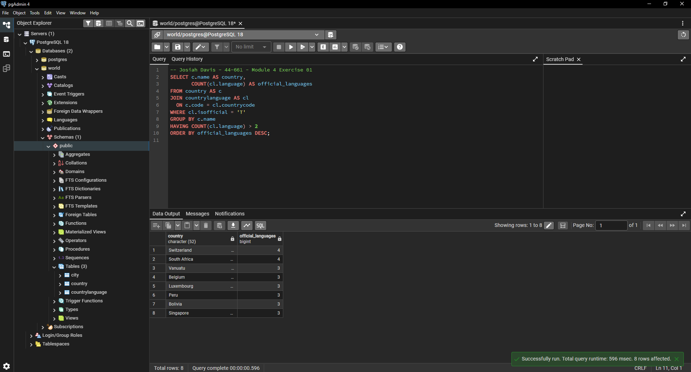
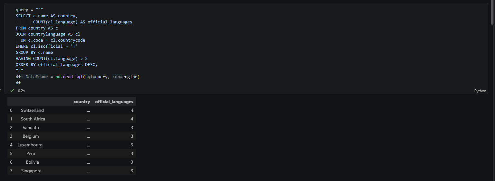
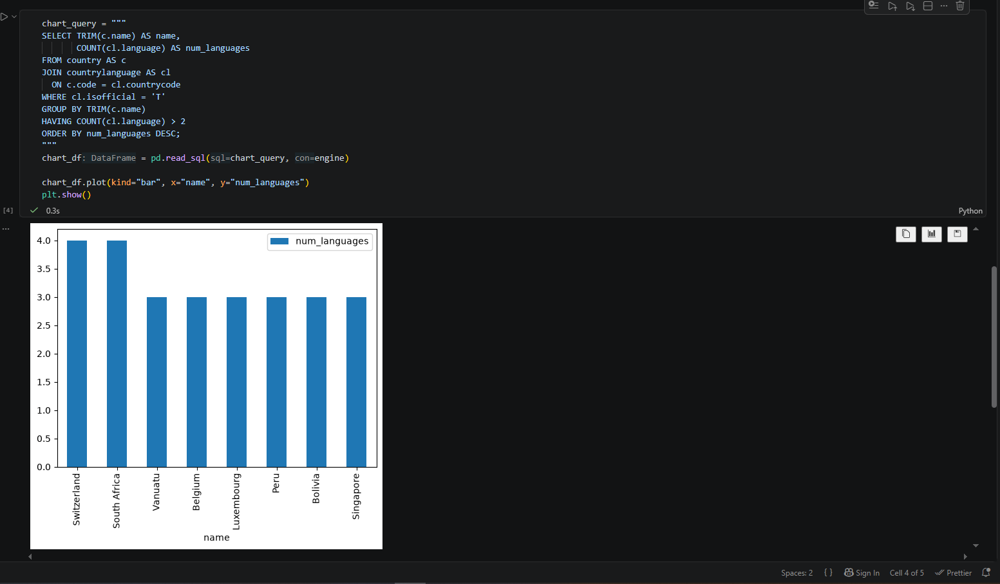

# Exercise 04: Advanced SQL, Jupyter, and Visualization

- Name: Josiah Davis
- Course: Database for Analytics
- Module: 4
- Database Used: World Database
- Tools Used: PostgreSQL, SQLAlchemy, Pandas, Jupyter Notebooks

---

## Instructions

- Complete each task using the **World database** installed earlier.
- For SQL questions:
  - Write the SQL command in a fenced code block
  - Execute the command and include a **screenshot of the results**
- For Jupyter Notebook questions:
  - Include the required Python statements
  - Include **screenshots of the notebook output**
- Store all screenshots in the `screenshots/` folder and embed them below each question.

---

## Question 1

Considering the World database, write a SQL statement that will
**display the names of countries**
that speak **more than two official languages**,
along with the **number of official languages spoken**.

- Sort the results by **number of languages**, from **most to least**.
- _Hint: There are fewer than 10 countries in the results._

### SQL

```sql
SELECT c.name AS country,
       COUNT(cl.language) AS official_languages
FROM country AS c
JOIN countrylanguage AS cl
  ON c.code = cl.countrycode
WHERE cl.isofficial = 'T'
GROUP BY c.name
HAVING COUNT(cl.language) > 2
ORDER BY official_languages DESC;
```

Returns 8 rows. Switzerland and South Africa have 4 official languages.
Vanuatu, Belgium, Luxembourg, Peru, Bolivia, and Singapore have 3.

### Screenshot



---

## Question 2

Using **Jupyter Notebooks**, you must use the
`create_engine` command to connect to your database.

After the `create_engine` command is executed,
**what are the three statements** required to
execute the query from Question 1 and
**display the results in the notebook**?

### Python Code

```python
query = """
SELECT c.name AS country,
       COUNT(cl.language) AS official_languages
FROM country AS c
JOIN countrylanguage AS cl
  ON c.code = cl.countrycode
WHERE cl.isofficial = 'T'
GROUP BY c.name
HAVING COUNT(cl.language) > 2
ORDER BY official_languages DESC;
"""
df = pd.read_sql(query, engine)
df
```

The three statements are: assign the SQL to a string variable, pass it to
`pd.read_sql` with the engine to get a DataFrame, and reference the DataFrame
on its own line so the notebook renders it.

### Screenshot



---

## Question 3

Using **Jupyter Notebooks**, write the Python code needed
to produce the following graph:


(The graph shows country-level results derived from the World database.)

### Python Code

```python
chart_query = """
SELECT TRIM(c.name) AS name,
       COUNT(cl.language) AS num_languages
FROM country AS c
JOIN countrylanguage AS cl
  ON c.code = cl.countrycode
WHERE cl.isofficial = 'T'
GROUP BY TRIM(c.name)
HAVING COUNT(cl.language) > 2
ORDER BY num_languages DESC;
"""
chart_df = pd.read_sql(chart_query, engine)

chart_df.plot(kind="bar", x="name", y="num_languages")
plt.show()
```

`country.name` is `character(52)`, so values come back padded with trailing
spaces. Without `TRIM` the x axis labels render with the padding included.

### Screenshot


