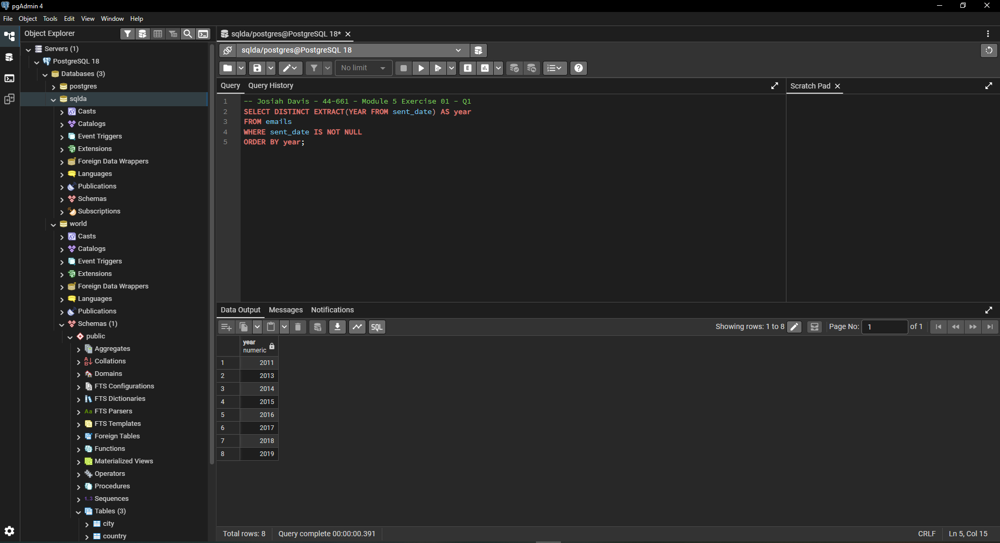
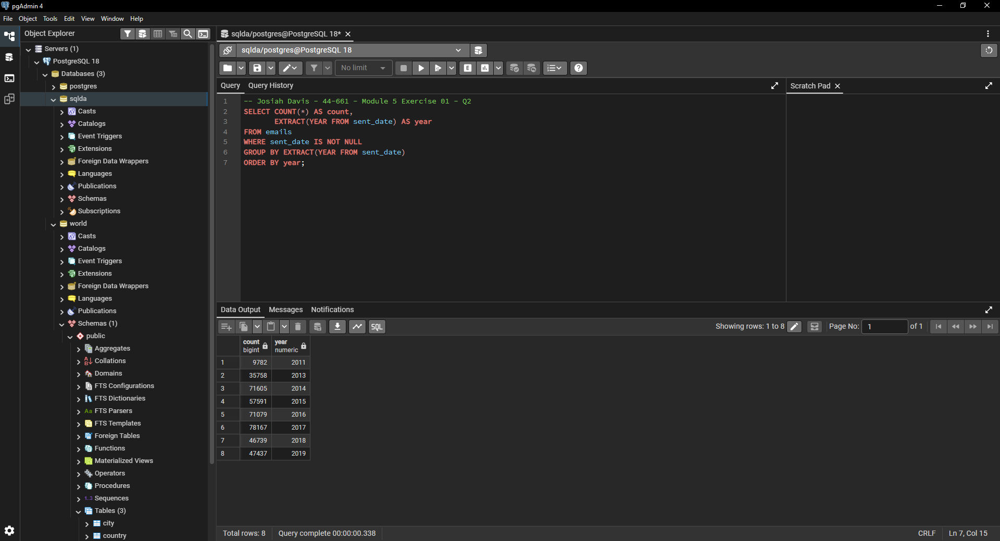
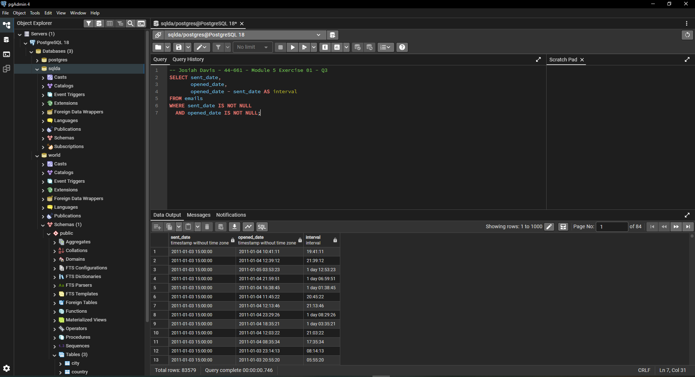
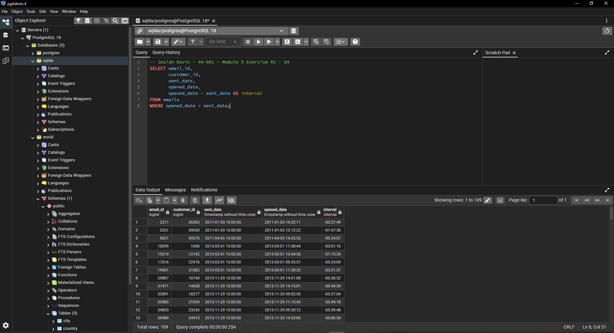
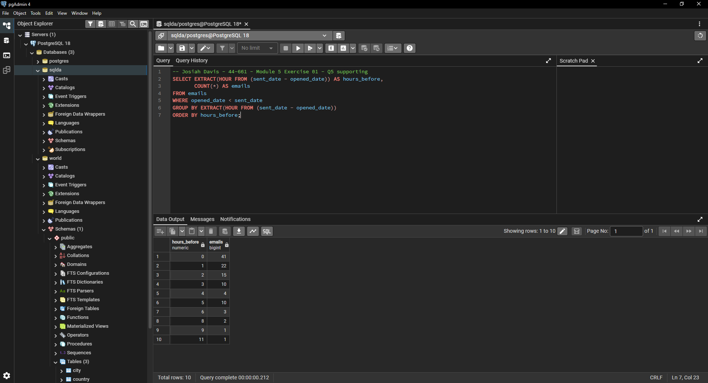
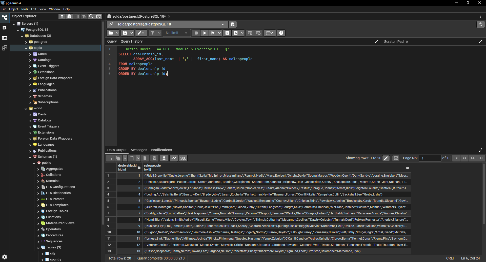
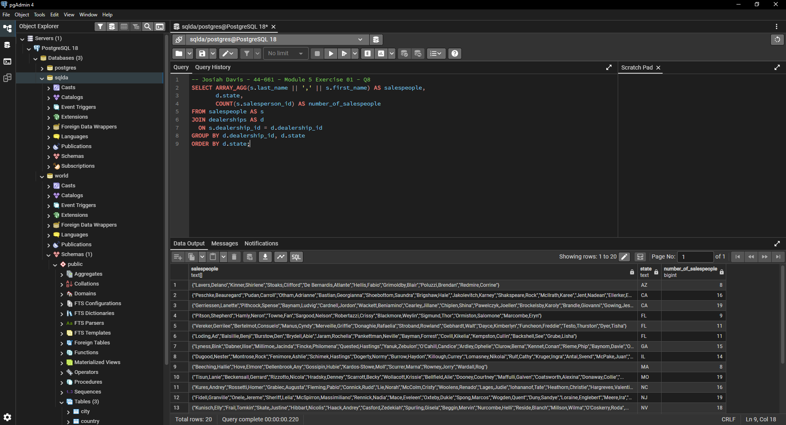
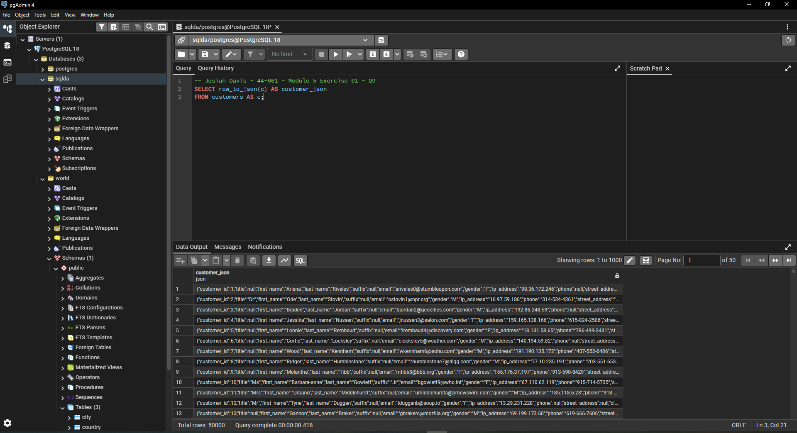
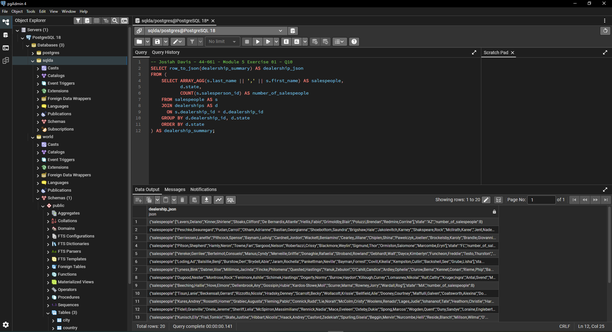

# Exercise 05: SQLDA Database - Dates, Data Quality, Arrays, and JSON

- Name: Josiah Davis
- Course: Database for Analytics
- Module: 5
- Database Used: `sqlda` (Sample Datasets)
- Tools Used: PostgreSQL (pgAdmin or psql)

---

## Instructions

- Use the **sqlda** database from the "Loading the Sample Datasets" instructions.
- For each SQL task:
  - Include your SQL in a fenced code block
  - Execute it and include a **screenshot** showing the query and results
- Store screenshots in the `screenshots/` folder and embed them below each answer.
- For explanation questions:
  - Write your answer in complete sentences
  - Include a screenshot if requested

---

## Question 1

Using the `sqlda` database, write the SQL needed
to show a **list of years** that emails were sent.

Your results should list years like this (order matters):

```text
year
2011
2013
2014
2015
2016
2017
2018
2019
```

### SQL

```sql
SELECT DISTINCT EXTRACT(YEAR FROM sent_date) AS year
FROM emails
WHERE sent_date IS NOT NULL
ORDER BY year;
```

Returns 8 rows. There are no emails sent in 2012.

### Screenshot



---

## Question 2

Using the `sqlda` database, write the SQL needed to
show the **number of messages sent by year**,
ordered by year (as shown in the prompt).

Output should resemble:

```text
count   year
...
```

### SQL

```sql
SELECT COUNT(*) AS count,
       EXTRACT(YEAR FROM sent_date) AS year
FROM emails
WHERE sent_date IS NOT NULL
GROUP BY EXTRACT(YEAR FROM sent_date)
ORDER BY year;
```

Volume runs from 9,782 in 2011 up to a peak of 78,167 in 2017, then drops
to 47,437 in 2019. The counts sum to 418,158, which matches the row count
loaded into the emails table.

### Screenshot



---

## Question 3

Using the `sqlda` database, write the SQL needed to show:

- the **sent date**
- the **opened date**
- the **interval** between the two

Only include emails that contain **both** a sent date and an opened date.

### SQL

```sql
SELECT sent_date,
       opened_date,
       opened_date - sent_date AS interval
FROM emails
WHERE sent_date IS NOT NULL
  AND opened_date IS NOT NULL;
```

83,579 rows have both dates. Most intervals fall between a few hours and
a couple of days.

### Screenshot



---

## Question 4

Using the `sqlda` database,
write the SQL needed to
show emails that contain an **opened date BEFORE the sent date**.

### SQL

```sql
SELECT email_id,
       customer_id,
       sent_date,
       opened_date,
       opened_date - sent_date AS interval
FROM emails
WHERE opened_date < sent_date;
```

109 rows.

### Screenshot



---

## Question 5

Using the `sqlda` database:
there are **over 100 emails**
that contain an opened date **BEFORE** the sent date.

After looking at the data, **why is this the case?**

### Answer

The sent dates and the opened dates are not recorded in the same time zone.

Every `sent_date` in the table is exactly 15:00:00, with no variation across
418,158 rows, so sends are stamped in one fixed zone. The `opened_date` looks
like it is stamped in the customer's local time instead.

Binning the 109 negative intervals by hour shows the pattern:

| hours before sent | emails |
|---|---|
| 0 | 41 |
| 1 | 22 |
| 2 | 15 |
| 3 | 10 |
| 4 | 4 |
| 5 | 10 |
| 6 | 3 |
| 8 | 2 |
| 9 | 1 |
| 11 | 1 |

105 of the 109 land between 0 and 6 hours behind. That is the span of US
time zones against UTC, where Eastern is 5 hours behind and Pacific is 8.
Nothing is negative by days, which is what you would expect if this were
bad data entry or a failed load.

The column type is why nothing caught it. Both columns are
`timestamp without time zone`, so Postgres stores the wall clock reading
and has no way to know the two columns mean different things. Using
`timestamptz` would have made the offset explicit and the comparison
would have worked correctly.

Supporting query:

```sql
SELECT EXTRACT(HOUR FROM (sent_date - opened_date)) AS hours_before,
       COUNT(*) AS emails
FROM emails
WHERE opened_date < sent_date
GROUP BY EXTRACT(HOUR FROM (sent_date - opened_date))
ORDER BY hours_before;
```

### Screenshot



---

## Question 6

Using the `sqlda` database, explain in your own words what the following code does:

```sql
CREATE TEMP TABLE customer_points AS (
    SELECT
        customer_id,
        point(longitude, latitude) AS lng_lat_point
    FROM customers
    WHERE longitude IS NOT NULL
    AND latitude IS NOT NULL
);

CREATE TEMP TABLE dealership_points AS (
    SELECT
        dealership_id,
        point(longitude, latitude) AS lng_lat_point
    FROM dealerships
);

CREATE TEMP TABLE customer_dealership_distance AS (
    SELECT
       customer_id,
       dealership_id,
       c.lng_lat_point <@> d.lng_lat_point AS distance
    FROM customer_points c
    CROSS JOIN dealership_points d
);
```

### Answer

The code builds three temp tables that together measure how far every
customer is from every dealership.

`customer_points` takes each customer's longitude and latitude and packs
them into a single `point` value. The WHERE clause drops customers missing
either coordinate, since a point needs both.

`dealership_points` does the same thing for every dealership. There is no
filter here because all 20 dealerships have coordinates.

`customer_dealership_distance` CROSS JOINs the two, which pairs every
customer with every dealership, then applies the `<@>` operator to each
pair. That operator comes from the earthdistance extension and returns the
great-circle distance between two points in miles.

The grain of the result is one row per customer-dealership combination.
With roughly 50,000 customers and 20 dealerships that is close to a million
rows, which is why it makes sense as a temp table rather than something you
query repeatedly.

The reason for doing it this way is that once the distances exist as rows,
finding each customer's nearest dealership becomes a normal GROUP BY with
MIN instead of a geospatial calculation.

---

## Question 7

Using the `sqlda` database,
write SQL to display an
**array of salespeople for each dealership**,
sorted by dealership.

For example - dealership 1 is below:

```text
"{""Fidell,Granville"",""Onele,Jereme"",""Sheriff,Lelia"",""McSpirron,Massimiliano"",""Rennick,Nadia"",""Mace,Eveleen"",""Oxteby,Dukie"",""Spong,Marcos"",""Wogden,Quent"",""Duny,Sandye"",""Loraine,Englebert"",""Meere,Ira"",""Gibbens,Cristine"",""Prine,Lyda"",""McCoughan,Sheff"",""Schule,Giselbert"",""McAndie,Eleen"",""Dosedale,Dorie"",""Nafziger,Shay""}"
```

### SQL

```sql
SELECT dealership_id,
       ARRAY_AGG(last_name || ',' || first_name) AS salespeople
FROM salespeople
GROUP BY dealership_id
ORDER BY dealership_id;
```

Returns 20 rows, one per dealership. Dealership 1 matches the sample
output including the order of names.

### Screenshot



---

## Question 8

Using the `sqlda` database, write SQL to display:

- an **array of salespeople for each dealership**
- the **state** of the dealership
- the **number of salespeople** for the dealership

Sort by **state**.

Reference image:


### SQL

```sql
SELECT ARRAY_AGG(s.last_name || ',' || s.first_name) AS salespeople,
       d.state,
       COUNT(s.salesperson_id) AS number_of_salespeople
FROM salespeople AS s
JOIN dealerships AS d
  ON s.dealership_id = d.dealership_id
GROUP BY d.dealership_id, d.state
ORDER BY d.state;
```

The GROUP BY includes `d.dealership_id` as well as `d.state`. Grouping on
state alone would merge dealerships that share a state into one array.
California has two dealerships and Florida has three, so that would have
changed the answer.

### Screenshot



---

## Question 9

Using the `sqlda` database, write the SQL needed to convert
the **customers** table to **JSON**.

### SQL

```sql
SELECT row_to_json(c) AS customer_json
FROM customers AS c;
```

Returns 50,000 rows, one JSON object per customer.

### Screenshot



---

## Question 10

Using the `sqlda` database, write SQL to display:

- an **array of salespeople for each dealership**
- the **state**
- the **number of salespeople**
- sorted by **state**

Then **convert this result to JSON**.

Reference image:


### SQL

```sql
SELECT row_to_json(dealership_summary) AS dealership_json
FROM (
    SELECT ARRAY_AGG(s.last_name || ',' || s.first_name) AS salespeople,
           d.state,
           COUNT(s.salesperson_id) AS number_of_salespeople
    FROM salespeople AS s
    JOIN dealerships AS d
      ON s.dealership_id = d.dealership_id
    GROUP BY d.dealership_id, d.state
    ORDER BY d.state
) AS dealership_summary;
```

This is Question 8 wrapped in a subquery. `row_to_json` needs a row source
to work on and cannot take an aggregate query directly, so the Q8 query goes
inside the FROM clause and gets an alias. The alias is what `row_to_json`
converts.

Returns the same 20 rows as Question 8, each one as a JSON object.

### Screenshot


