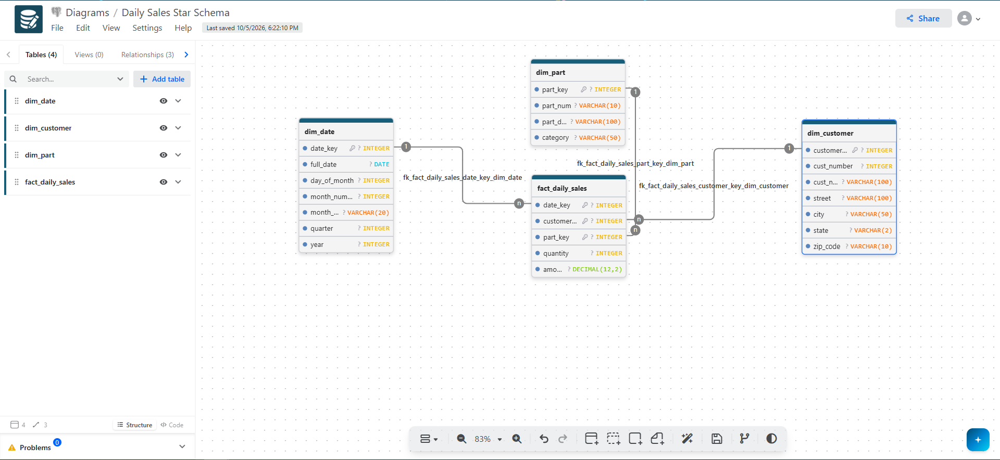

# Module 6 - Exercise 1: Creating a Data Warehouse

From the Operational Model to the Dimensional Model

- Name: Josiah Davis
- Course: Database for Analytics
- Module: 6

---

## Overview

In this exercise you will design a **dimensional (star schema) model**
for a data warehouse based on an **operational sales database**.

- **Business process:** Customer Sales
- **Grain:** Daily sales
- **Facts to store (only):**
  - **amount** = daily sales total amount (revenue)
  - **quantity** = daily sales total quantity (units sold)

You will determine the dimensions needed to support the required analytics.

---

## Operational Database Summary (Source System)

Tables in the operational model include:

- `customer` (custNumber, custName, address, currBal, credLimit, repNum)
- `parts` (partNum, partDesc, category, unitsOnHand, warehouseNum, unitPrice)
- `slsrep` (repNum, repName, repAddress, totComm, commRate)
- `orders` (orderNum, orderDate, custNum)
- `orderline` (orderNum, partNum, numOrdered)

---

## Analytics Requirements (What the Warehouse Must Support)

Your dimensional model must support questions such as:

- How many of part number **ax12** were sold on **September 2, 1994**?
- How many of part number **ax12** did customer **124** purchase last year?
- How much did customer **124** spend last year?
- What was the **average amount spent per customer per day** during September 1994?
- What was the **average quantity sold of part ax12 per day** during September 1994?
- What was the **average daily sales** during the third quarter of 1994?
- How many **appliance** items were sold during the third quarter of 1994?
- What was the amount of revenue generated by customers in
  **zip code 64468** during September 1994?

---

## Out of Scope

We do **not** care about:

- Questions about **specific orders** (order-level reporting)
- Questions about **sales reps**
- Questions about **credit limits, balances**, or other customer finance fields
- Inventory questions (warehouseNum, unitsOnHand, etc.)

---

## Key Design Constraints

- The warehouse must be a **star schema**.
- The fact table must store only:
  - `amount`
  - `quantity`
- Data must be **aggregated as necessary from the operational database before loading**.
- The grain is **daily sales** (not per order, not per orderline).

---

## Your Task

### Step 1: Design the Star Schema

Create a dimensional model that includes:

- One **fact table** (daily customer sales facts)
- Appropriate **dimension tables** (you decide which ones are necessary)

Your model must clearly show:

- Fact table name and fields
- Dimension table names and fields
- Primary keys and foreign keys
- Relationships (dimensions connect to the fact table)

---

## Deliverables

### 1) Star Schema Diagram (Required)

#### Diagram



Built in drawDB by writing the DDL first and using Import from SQL.

```sql
CREATE TABLE dim_date (
    date_key INTEGER PRIMARY KEY,
    full_date DATE,
    day_of_month INTEGER,
    month_number INTEGER,
    month_name VARCHAR(20),
    quarter INTEGER,
    year INTEGER
);

CREATE TABLE dim_customer (
    customer_key INTEGER PRIMARY KEY,
    cust_number INTEGER,
    cust_name VARCHAR(100),
    street VARCHAR(100),
    city VARCHAR(50),
    state VARCHAR(2),
    zip_code VARCHAR(10)
);

CREATE TABLE dim_part (
    part_key INTEGER PRIMARY KEY,
    part_num VARCHAR(10),
    part_desc VARCHAR(100),
    category VARCHAR(50)
);

CREATE TABLE fact_daily_sales (
    date_key INTEGER REFERENCES dim_date(date_key),
    customer_key INTEGER REFERENCES dim_customer(customer_key),
    part_key INTEGER REFERENCES dim_part(part_key),
    quantity INTEGER,
    amount DECIMAL(12,2),
    PRIMARY KEY (date_key, customer_key, part_key)
);
```

---

### 2) Design Notes (Required)

#### Design Notes

**Dimensions**

Three dimensions: Date, Customer, and Part. The requirements rule out most
of the operational model. Sales reps, credit limits, balances, warehouse
numbers, and units on hand are all explicitly out of scope, and orders and
order lines are named as unnecessary. Date, Customer, and Part are what the
eight required questions actually reference.

The customer address needed splitting. In the operational table it is one
text field, "481 Oak, Lansing, MI". Question 8 filters on zip code 64468,
which is not something you can do against a text blob without parsing it on
every query. The dimension stores street, city, state, and zip as separate
columns so the filter is a plain WHERE clause.

`unitPrice` is deliberately not in `dim_part`. Price is used to compute
`amount` during the load and then the result is stored. Keeping price in the
dimension would mean a price change rewrites the history of what customers
actually paid.

**Grain**

One row per customer, per part, per day.

The source data sits at order line level, which is finer than the warehouse
needs. The requirements say the grain is daily sales and that orders do not
matter, so the order lines get summed during the load:

- `quantity` = SUM(numOrdered)
- `amount` = SUM(numOrdered * unitPrice)

The composite primary key on `fact_daily_sales` is `date_key`,
`customer_key`, `part_key` together. That enforces the grain at the database
level rather than by convention. One customer buying one part on one day
produces one row and there is no way to insert a second.

Dropping order numbers is what makes the daily grain possible. Looking at
the sample data, order 12489 and order 12500 are both customer 124 buying
part bt04. At order grain those are two rows. At daily grain on 9/5/1994
they collapse into one, which is what a question like "how much did customer
124 spend last year" is actually asking for.

**Surrogate keys**

Each dimension has a surrogate key (`date_key`, `customer_key`, `part_key`)
alongside its natural key from the source system (`cust_number`, `part_num`).

The natural keys would work for this dataset. The surrogate keys are there
because source systems reuse and change identifiers. If customer 124 moves
to a different zip, a surrogate key lets the warehouse keep both the old and
new version as separate rows, so sales from before the move stay attached to
the old zip. With `cust_number` as the key you would have to overwrite the
address and quietly rewrite history.

**How the design answers the questions**

| Question | Resolved by |
|---|---|
| ax12 sold on 9/2/1994 | `dim_part.part_num` + `dim_date.full_date` |
| ax12 bought by customer 124 last year | `part_num` + `cust_number` + `year` |
| Customer 124 total spend last year | `cust_number` + `year`, SUM(amount) |
| Avg amount per customer per day, Sept 1994 | `month_number` + `year`, AVG over customer_key and date_key |
| Avg quantity of ax12 per day, Sept 1994 | `part_num` + `month_number`, AVG(quantity) |
| Avg daily sales, Q3 1994 | `dim_date.quarter` + `year` |
| Appliance items sold, Q3 1994 | `dim_part.category` + `quarter` |
| Revenue from zip 64468, Sept 1994 | `dim_customer.zip_code` + `month_number` |

Every question resolves with a join from the fact table to one or two
dimensions and an aggregate. None of them require a second hop, which is the
difference between a star and a snowflake.
