# Final Project: Building a Brazilian E-Commerce Database

- Name: Josiah Davis
- Course: Databases for Analytics (44-661)
- Module: 7

---

## Overview

This project loads the Olist Brazilian e-commerce dataset into PostgreSQL,
verifies the load, and then queries it to answer questions the raw files do
not answer on their own.

The headline finding is that the most obvious column in the dataset, the
customer ID, does not mean what it appears to mean. Counting it the obvious
way produces a false conclusion about the business. Section 7 walks through
how I found that and what the correct number is.

---

## 1. The Initial Data Source

**Olist Brazilian E-Commerce Public Dataset**

- Source: <https://www.kaggle.com/datasets/olistbr/brazilian-ecommerce>
- Publisher: Olist, a Brazilian marketplace that connects small sellers to
  larger storefronts
- License: CC BY-NC-SA 4.0
- Coverage: orders placed between 2016-09-04 and 2018-10-17

The dataset ships as nine separate CSV files. Four of them carry the
transactional core and relate to each other through real foreign keys, so
those are the four I loaded.

I chose this dataset because the relationships are genuine rather than
decorative. The order items table cannot be understood without the orders
table, and the orders table cannot be understood without customers. A query
that answers anything useful has to cross at least three of them.

---

## 2. Format, Columns, and Rows

The source files are comma-separated, UTF-8, with a header row.

| Table | Source file | Columns | Rows |
|---|---|---|---|
| `customers` | olist_customers_dataset.csv | 5 | 99,441 |
| `products` | olist_products_dataset.csv | 9 | 32,951 |
| `orders` | olist_orders_dataset.csv | 8 | 99,441 |
| `order_items` | olist_order_items_dataset.csv | 7 | 112,650 |

Total: 29 columns across 344,483 rows.

All four tables clear the 1,000 row requirement. The database contains
string types (`VARCHAR`), numeric types (`NUMERIC`, `INTEGER`), and date
types (`TIMESTAMP`).

---

## 3. Data Dictionary

### customers

| Column | Type | Description |
|---|---|---|
| `customer_id` | VARCHAR(50) | Key for a single order. **Not a person.** See Section 7. |
| `customer_unique_id` | VARCHAR(50) | The actual person. Stable across orders. |
| `customer_zip_code_prefix` | VARCHAR(10) | First five digits of the Brazilian postal code |
| `customer_city` | VARCHAR(100) | City name |
| `customer_state` | VARCHAR(2) | Two-letter Brazilian state code |

### products

| Column | Type | Description |
|---|---|---|
| `product_id` | VARCHAR(50) | Unique product identifier |
| `product_category_name` | VARCHAR(100) | Category in Portuguese |
| `product_name_lenght` | NUMERIC | Character count of the product name. Misspelled in the source. |
| `product_description_lenght` | NUMERIC | Character count of the description. Also misspelled in the source. |
| `product_photos_qty` | NUMERIC | Number of photos on the listing |
| `product_weight_g` | NUMERIC | Weight in grams |
| `product_length_cm` | NUMERIC | Package length |
| `product_height_cm` | NUMERIC | Package height |
| `product_width_cm` | NUMERIC | Package width |

### orders

| Column | Type | Description |
|---|---|---|
| `order_id` | VARCHAR(50) | Unique order identifier |
| `customer_id` | VARCHAR(50) | Foreign key to `customers` |
| `order_status` | VARCHAR(20) | delivered, shipped, canceled, invoiced, processing, unavailable, created, approved |
| `order_purchase_timestamp` | TIMESTAMP | When the order was placed |
| `order_approved_at` | TIMESTAMP | When payment cleared. NULL for 160 orders. |
| `order_delivered_carrier_date` | TIMESTAMP | Handoff to the carrier |
| `order_delivered_customer_date` | TIMESTAMP | Delivery to the customer. NULL for 2,965 orders. |
| `order_estimated_delivery_date` | TIMESTAMP | Date promised to the customer at purchase |

### order_items

| Column | Type | Description |
|---|---|---|
| `order_id` | VARCHAR(50) | Foreign key to `orders`. Part of the composite key. |
| `order_item_id` | INTEGER | Line number within the order. Part of the composite key. |
| `product_id` | VARCHAR(50) | Foreign key to `products` |
| `seller_id` | VARCHAR(50) | Seller fulfilling this line |
| `shipping_limit_date` | TIMESTAMP | Deadline for the seller to hand off to the carrier |
| `price` | NUMERIC(10,2) | Item price in Brazilian reais |
| `freight_value` | NUMERIC(10,2) | Shipping charged on this line |

---

## 4. Table Structure

```sql
CREATE TABLE customers (
    customer_id VARCHAR(50) PRIMARY KEY,
    customer_unique_id VARCHAR(50),
    customer_zip_code_prefix VARCHAR(10),
    customer_city VARCHAR(100),
    customer_state VARCHAR(2)
);

CREATE TABLE products (
    product_id VARCHAR(50) PRIMARY KEY,
    product_category_name VARCHAR(100),
    product_name_lenght NUMERIC,
    product_description_lenght NUMERIC,
    product_photos_qty NUMERIC,
    product_weight_g NUMERIC,
    product_length_cm NUMERIC,
    product_height_cm NUMERIC,
    product_width_cm NUMERIC
);

CREATE TABLE orders (
    order_id VARCHAR(50) PRIMARY KEY,
    customer_id VARCHAR(50) REFERENCES customers(customer_id),
    order_status VARCHAR(20),
    order_purchase_timestamp TIMESTAMP,
    order_approved_at TIMESTAMP,
    order_delivered_carrier_date TIMESTAMP,
    order_delivered_customer_date TIMESTAMP,
    order_estimated_delivery_date TIMESTAMP
);

CREATE TABLE order_items (
    order_id VARCHAR(50) REFERENCES orders(order_id),
    order_item_id INTEGER,
    product_id VARCHAR(50) REFERENCES products(product_id),
    seller_id VARCHAR(50),
    shipping_limit_date TIMESTAMP,
    price NUMERIC(10,2),
    freight_value NUMERIC(10,2),
    PRIMARY KEY (order_id, order_item_id)
);
```

Verified against the catalog:

```sql
SELECT table_name, column_name, data_type, character_maximum_length
FROM information_schema.columns
WHERE table_schema = 'public'
ORDER BY table_name, ordinal_position;
```

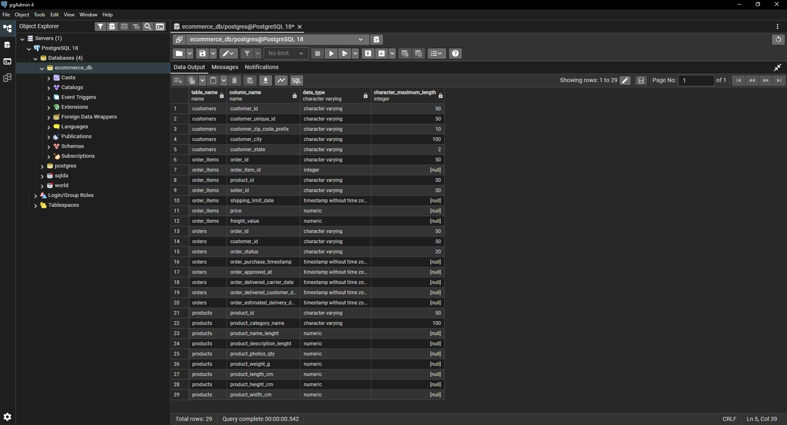

### Design decisions

**Zip code as VARCHAR, not INTEGER.** Brazilian postal prefixes have leading
zeros. An integer column silently drops them and turns 01037 into 1037.

**Composite primary key on `order_items`.** One order can contain several
lines, so `order_id` alone is not unique. The natural key is
`order_id` plus `order_item_id` together.

**Kept the misspellings.** The source headers read `product_name_lenght` and
`product_description_lenght`. Correcting them would break the header match
on load. The right place to fix a source typo is in a view, not during
ingestion.

---

## 5. Loading the Data

Tables had to load in dependency order. `orders` references `customers`, and
`order_items` references both `orders` and `products`, so the parents go
first or the foreign keys reject every row.

```sql
COPY customers   FROM 'C:\temp\olist_customers_dataset.csv'   WITH (FORMAT csv, HEADER true);
COPY products    FROM 'C:\temp\olist_products_dataset.csv'    WITH (FORMAT csv, HEADER true);
COPY orders      FROM 'C:\temp\olist_orders_dataset.csv'      WITH (FORMAT csv, HEADER true);
COPY order_items FROM 'C:\temp\olist_order_items_dataset.csv' WITH (FORMAT csv, HEADER true);
```

### Obstacles

**Permission denied on the first attempt.** Server-side `COPY` runs as the
PostgreSQL service account, which cannot read a user's Downloads folder on
Windows. Moving the files to `C:\temp` solved it. The alternative is psql's
`\copy`, which reads as the logged-in user instead.

**The header row.** The course example loaded everything as `VARCHAR` first,
deleted the header row, exported a clean file, then recreated the tables with
real types and reloaded. That is necessary for TSV, where `COPY` cannot skip
a header. For CSV it can. `FORMAT csv, HEADER true` skips the header and also
treats empty fields as NULL, which let me load straight into `TIMESTAMP` and
`NUMERIC` columns in one pass and skip the whole varchar round trip.

**Empty date fields.** 2,965 orders have no delivery date and 160 have no
approval date. Under `FORMAT csv` these arrive as NULL rather than failing
the type conversion. Section 6 checks whether those NULLs are legitimate.

### Load verification

```sql
SELECT 'customers' AS table_name, COUNT(*) AS row_count FROM customers
UNION ALL SELECT 'products',    COUNT(*) FROM products
UNION ALL SELECT 'orders',      COUNT(*) FROM orders
UNION ALL SELECT 'order_items', COUNT(*) FROM order_items
ORDER BY table_name;
```

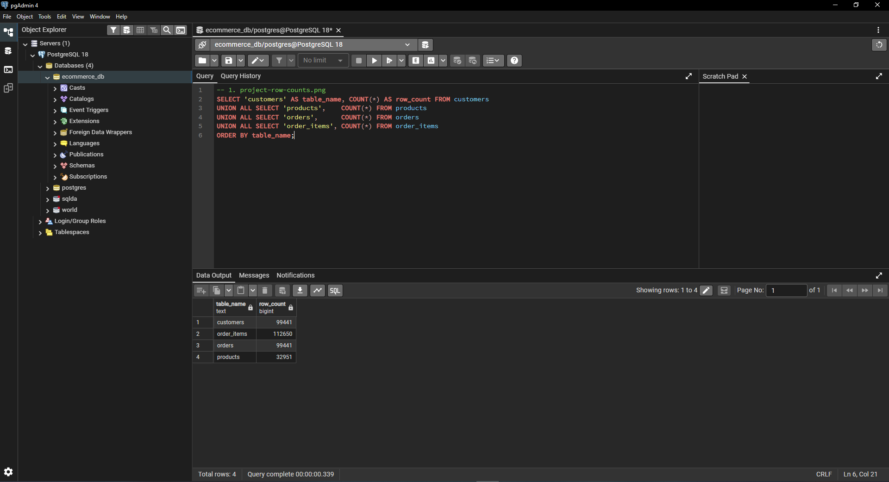

| Table | Expected | Loaded |
|---|---|---|
| customers | 99,441 | 99,441 |
| products | 32,951 | 32,951 |
| orders | 99,441 | 99,441 |
| order_items | 112,650 | 112,650 |

---

## 6. Verifying the Data

Matching row counts only proves the right number of rows arrived. It says
nothing about whether the values inside them are consistent.

### Are the NULL delivery dates a load failure?

2,965 orders have no `order_delivered_customer_date`, which is 3% of the
table. My first assumption was that the load had dropped values.

```sql
SELECT
    order_status,
    COUNT(*) AS total_orders,
    COUNT(*) FILTER (WHERE order_delivered_customer_date IS NULL) AS missing_delivery_date
FROM orders
GROUP BY order_status
ORDER BY missing_delivery_date DESC;
```

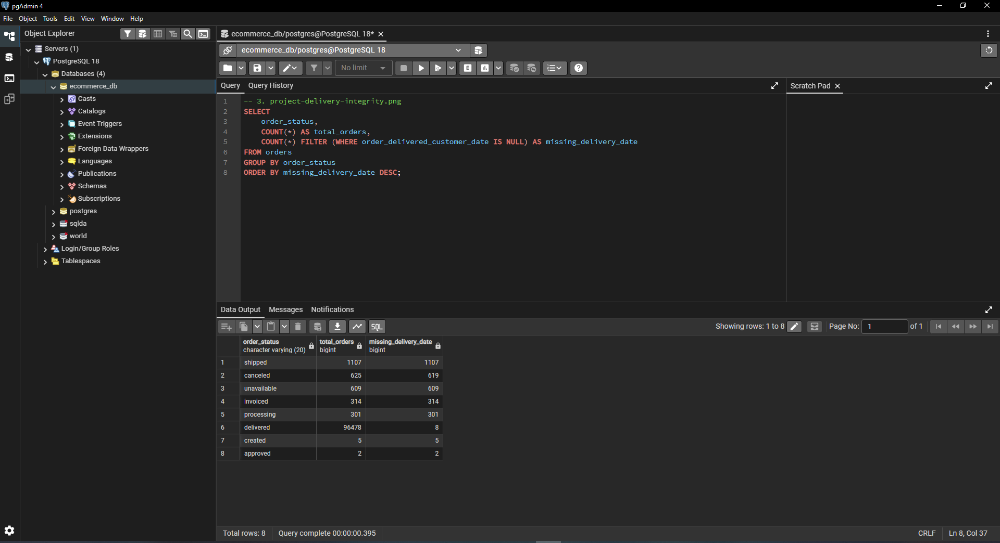

| order_status | total_orders | missing_delivery_date |
|---|---|---|
| shipped | 1,107 | 1,107 |
| canceled | 625 | 619 |
| unavailable | 609 | 609 |
| invoiced | 314 | 314 |
| processing | 301 | 301 |
| delivered | 96,478 | **8** |
| created | 5 | 5 |
| approved | 2 | 2 |

Most of it is correct. An order that is still shipping, or was canceled, or
was never available has no delivery date because it was never delivered.
That accounts for 2,957 of the 2,965.

The other 8 are marked `delivered` and still have no delivery date. That is
an inconsistency in the source system, not something the load caused.

```sql
SELECT order_id, order_status, order_purchase_timestamp,
       order_delivered_carrier_date, order_delivered_customer_date
FROM orders
WHERE order_status = 'delivered'
  AND order_delivered_customer_date IS NULL;
```

Eight rows out of 99,441 is 0.008%, small enough to ignore for most purposes.
It matters for one specific thing: any query that computes delivery time by
subtracting purchase date from delivery date will silently drop those rows.
If you report the result as covering all delivered orders, it does not.

### Referential integrity

```sql
SELECT COUNT(*) AS orphan_orders
FROM orders o
LEFT JOIN customers c ON o.customer_id = c.customer_id
WHERE c.customer_id IS NULL;
```

Returns 0. Every order points at a customer that exists, every order item
points at an order and a product that exist. The foreign key constraints
would have rejected the load otherwise, but confirming it explicitly is
cheap.

---

## 7. The Customer Count Is Wrong

This is the part of the project that changed what I thought the data said.

The `customers` table has 99,441 rows. The `orders` table also has 99,441
rows. That one-to-one match is the clue.

```sql
SELECT
    COUNT(*)                            AS customer_rows,
    COUNT(DISTINCT customer_id)         AS distinct_customer_id,
    COUNT(DISTINCT customer_unique_id)  AS distinct_people
FROM customers;
```

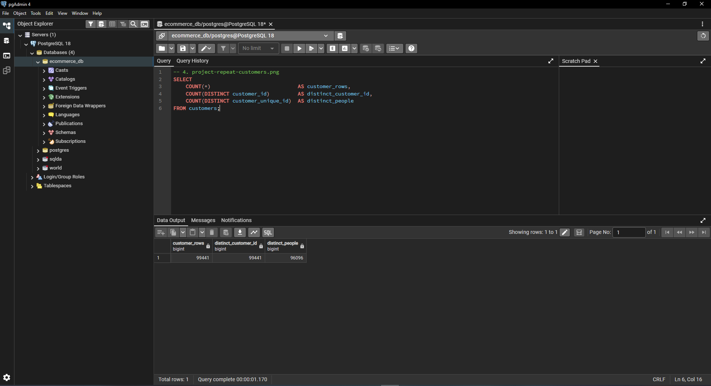

| Measure | Value |
|---|---|
| customer rows | 99,441 |
| distinct `customer_id` | 99,441 |
| distinct `customer_unique_id` | **96,096** |

Olist mints a new `customer_id` for every order. It is an order-scoped key
wearing a customer-shaped name. The person is `customer_unique_id`.

The consequence is direct. Count `customer_id` and you get 99,441 customers
placing 99,441 orders, which is exactly one order each and a repeat rate of
zero. That reading is wrong, and nothing in the schema stops you from
reaching it.

```sql
SELECT
    orders_placed,
    COUNT(*) AS people
FROM (
    SELECT customer_unique_id, COUNT(*) AS orders_placed
    FROM customers
    GROUP BY customer_unique_id
) AS per_person
GROUP BY orders_placed
ORDER BY orders_placed;
```

| orders_placed | people |
|---|---|
| 1 | 93,099 |
| 2 | 2,745 |
| 3 | 203 |
| 4 | 30 |
| 5 | 8 |
| 6 | 6 |
| 7 | 3 |
| 9 | 1 |
| 17 | 1 |

96,096 people. 2,997 of them ordered more than once. The repeat rate is 3.1%,
not 0%, and one person placed 17 orders.

3.1% is still low, and for a marketplace that is a real problem rather than a
data artifact. But 3.1% and 0% lead to different conversations. Zero says the
business model does not produce repeat purchase at all. Three percent says it
does, barely, and gives you 2,997 people to study.

---

## 8. Queries

### 8a. Revenue by state (four-table join)

Every table participates. The customer's state lives in `customers`, the
link to the order lives in `orders`, and the money lives in `order_items`.

```sql
SELECT
    c.customer_state,
    COUNT(DISTINCT o.order_id)        AS orders,
    ROUND(SUM(oi.price), 2)           AS item_revenue,
    ROUND(AVG(oi.price), 2)           AS avg_item_price
FROM customers AS c
JOIN orders AS o
    ON c.customer_id = o.customer_id
JOIN order_items AS oi
    ON o.order_id = oi.order_id
JOIN products AS p
    ON oi.product_id = p.product_id
GROUP BY c.customer_state
ORDER BY item_revenue DESC
LIMIT 10;
```

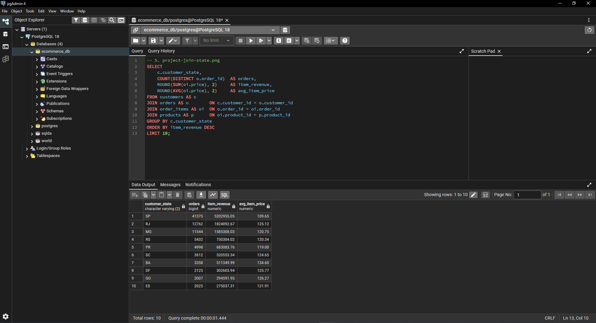

| State | Orders | Item revenue (R$) |
|---|---|---|
| SP | 41,375 | 5,202,955.05 |
| RJ | 12,762 | 1,824,092.67 |
| MG | 11,544 | 1,585,308.03 |
| RS | 5,432 | 750,304.02 |
| PR | 4,998 | 683,083.76 |

São Paulo alone is 38% of revenue across 27 states. The top three states are
63%. That concentration is geographic rather than behavioral, and it means
any national average is really an average of São Paulo plus noise.

### 8b. Revenue by product category (group by and aggregate)

```sql
SELECT
    p.product_category_name,
    COUNT(*)                 AS items_sold,
    ROUND(SUM(oi.price), 2)  AS revenue,
    ROUND(AVG(oi.price), 2)  AS avg_price
FROM order_items AS oi
JOIN products AS p
    ON oi.product_id = p.product_id
GROUP BY p.product_category_name
ORDER BY revenue DESC
LIMIT 10;
```

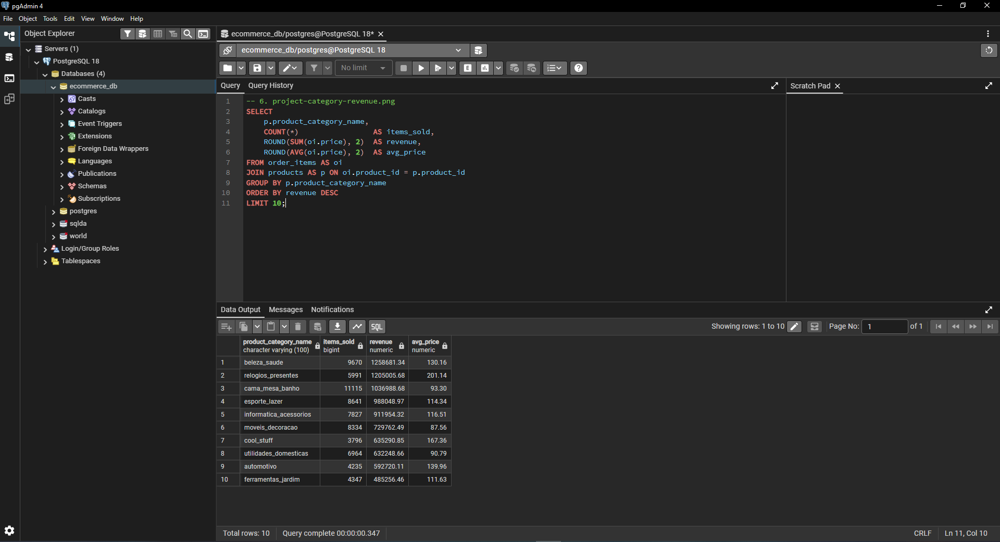

| Category | Items sold | Revenue (R$) | Avg price (R$) |
|---|---|---|---|
| beleza_saude (health and beauty) | 9,670 | 1,258,681.34 | 130.16 |
| relogios_presentes (watches and gifts) | 5,991 | 1,205,005.68 | 201.14 |
| cama_mesa_banho (bed, bath, table) | 11,115 | 1,036,988.68 | 93.30 |
| esporte_lazer (sports and leisure) | 8,641 | 988,048.97 | 114.34 |
| informatica_acessorios (computer accessories) | 7,827 | 911,954.32 | 116.51 |

Watches and gifts is the interesting row. It sells 46% fewer items than bed
and bath but earns more revenue, because the average ticket is more than
double. Ranking categories by unit volume and ranking them by revenue produce
different lists.

### 8c. Delivery time against the promise

This one uses the timestamp columns and the NULL finding from Section 6
at the same time.

```sql
SELECT
    c.customer_state,
    COUNT(*) AS delivered_orders,
    ROUND(AVG(o.order_delivered_customer_date::date
            - o.order_purchase_timestamp::date), 1) AS avg_days_to_deliver,
    ROUND(AVG(o.order_estimated_delivery_date::date
            - o.order_delivered_customer_date::date), 1) AS avg_days_early
FROM orders AS o
JOIN customers AS c
    ON o.customer_id = c.customer_id
WHERE o.order_status = 'delivered'
  AND o.order_delivered_customer_date IS NOT NULL
GROUP BY c.customer_state
ORDER BY avg_days_to_deliver DESC
LIMIT 10;
```

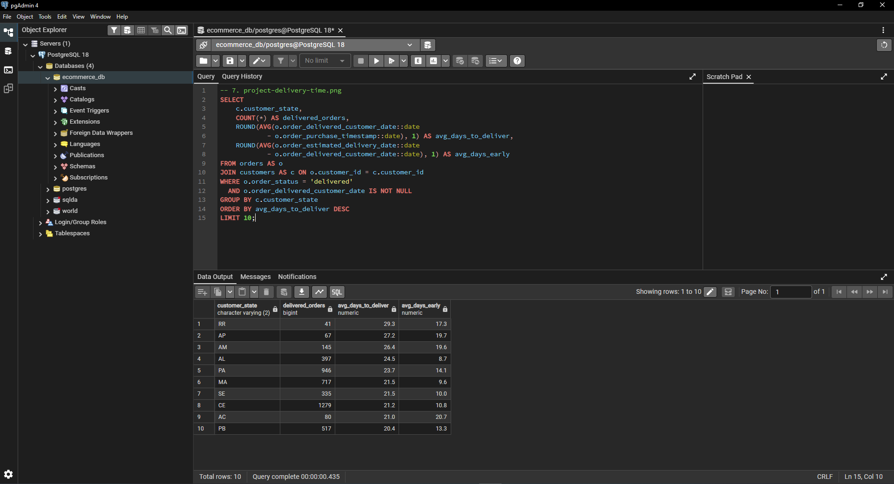

The ten slowest states are all in the north and northeast, led by Roraima at
29.3 days. None of them carry much volume. Roraima is 41 delivered orders
against São Paulo's 41,375, so these averages rest on small samples.

The second column is the more interesting one. Every slow state is still
arriving ahead of the estimated delivery date, Roraima by 17.3 days. The
estimate given at checkout is already padded for the route. A late delivery
in Roraima and a late delivery in São Paulo are not the same event, because
the customer was promised different things.

Across all 96,476 orders that have both timestamps, mean delivery is 12.6
days and the median is 10.2. The gap between those two says the distribution
has a long right tail, and it does: 306 orders took more than 60 days and the
slowest took 209.

The `IS NOT NULL` filter in that query is there because of Section 6. Without
it, the 8 broken rows are dropped silently by the arithmetic and the count
reported as "delivered orders" would be wrong by 8.

---

## 9. SELECT * From Each Table

### customers

```sql
SELECT * FROM customers LIMIT 10;
```

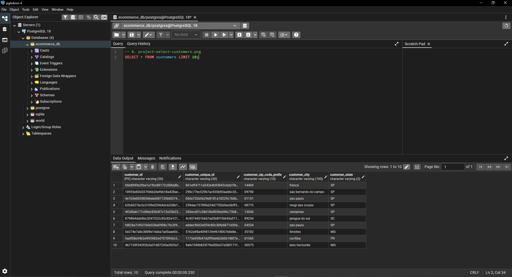

The zip prefixes in this output are the reason that column is VARCHAR.
09790 and 01151 would have become 9790 and 1151 in an integer column.

### products

```sql
SELECT * FROM products LIMIT 10;
```

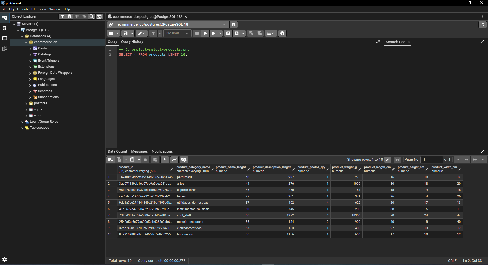

The misspelled headers are visible here as `product_name_lenght` and
`product_description_lenght`. They come from the source file and were kept
so the load would match on column name.

### orders

```sql
SELECT * FROM orders LIMIT 10;
```

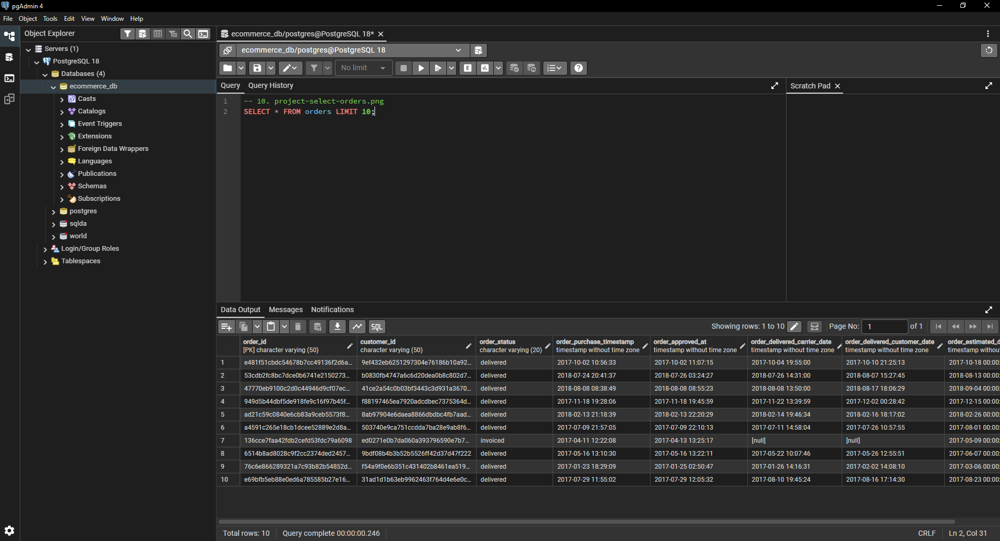

Row 7 is an invoiced order, and both delivery columns show `[null]` rather
than an empty string. That is the `FORMAT csv` load putting real NULLs in
the timestamp columns, and it is the same pattern Section 6 checks across
all 99,441 rows.

### order_items

```sql
SELECT * FROM order_items LIMIT 10;
```

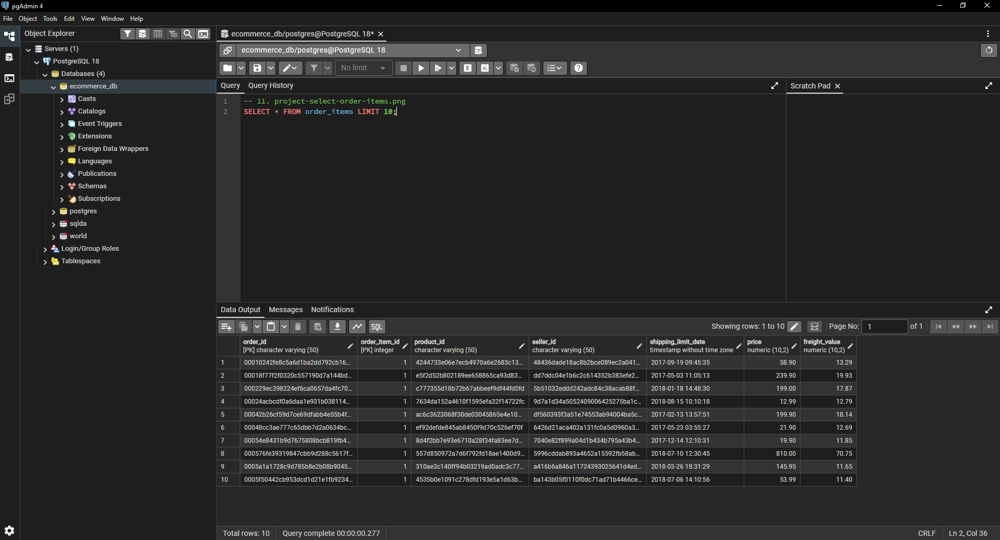

Both `order_id` and `order_item_id` carry the [PK] marker because neither is
unique on its own. `order_item_id` is the line number within an order, so
these ten rows all show 1 only because the sort puts single-item orders
first. An order with three products would have rows 1, 2 and 3.

---

## 10. What I Took Away

**The schema does not tell you what a column means.** `customer_id` is typed,
constrained, indexed, and named in plain English, and it still does not hold
what its name says. Nothing a database can enforce would have caught that.
The only reason I found it was that 99,441 customers and 99,441 orders was
too round a coincidence to leave alone.

**Matching row counts are a weak check.** All four of my tables loaded the
exact expected number of rows and the foreign keys all resolved, and the
database still contained 8 self-contradictory orders and a column that misled
on its face. Both findings came from queries I wrote after the load looked
clean.

**Cheap checks have a good hit rate.** Cross-tabbing the NULLs against status
took one query. Comparing two count-distincts took one more. Between them
they found the only two real problems in the dataset.

If I kept going, the next question is who those 2,997 repeat buyers are.
Whether they cluster in particular categories or states would say whether the
3.1% is something the business can act on or just a residue.

---

## Reproducing This

1. Download the dataset from
   <https://www.kaggle.com/datasets/olistbr/brazilian-ecommerce>
2. Extract the CSV files to `C:\temp`
3. Create a database named `ecommerce_db`
4. Run the `CREATE TABLE` statements in Section 4
5. Run the `COPY` statements in Section 5 in the order given
6. Verify with the row count query in Section 5

Environment: Windows 11, PostgreSQL 18, pgAdmin 4.
